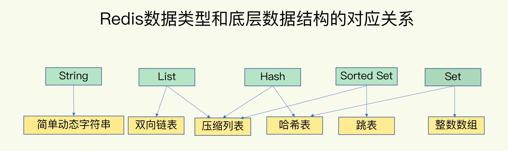

### 一、键值数据库的基础

- 存储哪些数据
    + string
    + hash表
    + 列表
    + 集合
- 对数据进行哪些操作
    + put
    + get
    + delete
    + scan
    + exists
- 使用内存保存键值数据，存在一定的数据丢失的风险
- 键值数据库的模块
    + 访问框架
        - 函数库调用供外部应用使用
        - 通过网络架构以socket通信的形式对外提供键值对操作
            + socket server
            + 协议解析
            + 处理网络链接、解析网络请求、数据存储处理
                - 单线程
                - 多线程
                - I/O模型设计
    + 操作模块
    + 索引模块
        - memcached和redis采用hash表作为k-v的索引
        - rocksDb采用跳表作为k-v的索引
        - 当通过索引找到value后，如果value是复杂结构，需要进一步找到实际需要的数据
            + 采用一些高效的索引结构作为value类型的底层数据结构
            + 这为redis实现高性能访问提供了良好的支撑
    + 存储模块
        - 分配器，处理内存空间的分配和回收
            + glibc的malloc和free
        - 持久化，存储数据至磁盘
            + 每一个k-v都立即存储
            + 周期性存储数据等

### 二、键值对中的数据类型-数据的保存形式，以及他们的底层实现

- 键和值采用什么结构组织
    + 使用hash表保存所有的键值对
    + hash表中的元素指向的都是值的指针
    + 使用hash表存储k-v带来一些性能上的问题
        - hash冲突，redis使用链式hash的方式解决
        - rehash带来的操作阻塞
- 整数数组和双向链表
    + 操作特点都是顺序读写
    + 操作复杂度基本是O（N）
- 压缩列表
    + 数组中的每一个元素都对应保存一个数据
    + 表头有三个字段
        - zlbytes
        - zltail
        - zllen
    + 列表尾部有一个zlend，表示列表结束
    + 单个数据节点entry的数据结构
        - prev_len：标识前一个entry的长度
            + 两种取值情况
            + 1个字节，表示前一个节点长度小于254
            + 5个字节，表示前一个节点大于254，
        - len，4个字节表示自身的长度
        - encoding：一个字节，表示编码的方式
        - content：保存实际的数据
    + 查找头尾元素的时候可以直接通过表头的首尾指针找到对应的元素
    + 查找非头尾元素时只能逐个查找，为O(N)的时间复杂度
- 跳表
    + 建立在有序链表的基础上
    + 建立多级索引完成元素的查找
- hash表
    + hash冲突
    + rehash复制
        - redis使用两张hash表，分key复制
        - 哪一个key被使用了，就rehash此key至新表，直至操作完成
- 记住常见集合的操作和复杂度
    + 单元素操作是基础，每种集合类型对单个数据实现增删改查操作比较快速
    + 范围操作非常耗时，遍历所有元素或者一定范围的元素，涉及到全表扫表，比较耗时
    + 统计操作通常高效，统计集合中的元素个数，集合结构中专门有记录的元素，较为高效
    + 例外情况只有几个-压缩链表和双向链表都会记录表头和表尾的偏移量，在列头或者尾操作元素很高效

### 三、redis为什么被称为单线程高性能

- redis的单线程：指的是redis处理网络I/O和处理数据操作使用单线程
- 对于其他的一些辅助功能，是另外启动额外的线程来实现的
- redis为什么使用单线程
    + 使用多线程时，如果涉及到很多共享变量的操作，为了保证共享变量的正确性，会使并行变串行，不能达到多线程原来的期望
    + 使用多线程也会需要引入同步框架等代码，使系统的调试和维护成本升高
    + 为了避免这些问题，redis采用了单线程
- 单线程为什么块
    + 多路复用机制
    + 基础I/O模型
        - 监听客户端请求(bind/listen)
        - 和客户端建立连接 accept
        - 从socket中读取请求 recv
        - 解析客户端发送的请求 parse
        - 根据请求的类型读取键值数据 get
        - 最后给客户端但会结果，向socket中写回数据 send
        - 潜在的阻塞点
            + 监听到某一个客户端需要建立连接请求时，accept一直不成功，会阻塞赛此处，导致其他的连接请求也无法建立
            + 还有类似的就是，在recv一个数据回客户端时，数据一直没有到达，也会阻塞在recv
            + 这些都会导致整个线程阻塞，无法处理其他的客户端请求，效率很低
    + 非阻塞模式的socket网络模型
        - 三个关键的函数调用-不同的操作调用后回返回不同的套接字类型
            + socket方法返回主动套接字
            + listen，将主动套接字转化为监听套接字，此时可以监听来自客户端的请求
                - 监听套接字设置为非阻塞后，accept变为非阻塞
                - 即当前一直没有连接请求到达时，redis可以处理其他操作，不需要一直等待
            + accept，接收到达客户端的连接，并返回已连接套接字
                - 已连接套接字设置为非阻塞后，send/recv变为非阻塞
                - 设置后，redis接收数据，以及处理完数据后向外发送变成非阻塞
    + 非阻塞模型基础上，使用Linux的多路复用的高性能I/O模型
        - 一个线程处理多个IO流，这就是select/epoll机制
        - 允许同时存在多个监听套接字和已连接套接字
        - 通过处理多个套接字，并使用对应的回调机制，针对不同事件的发生，调用相应的处理函数
        - 可以类比医院
            + 每个请求-患者都需要先分诊、测温、登记
            + 这些工作交给内核监听-分诊台完成
            + 最后再由医生进行实际的诊断，医生就是一个单线程，效率也很高