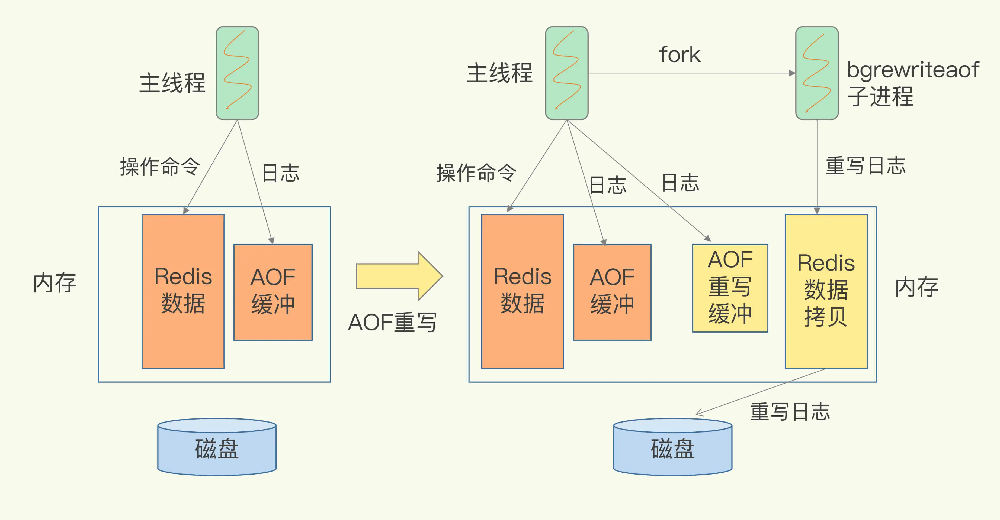
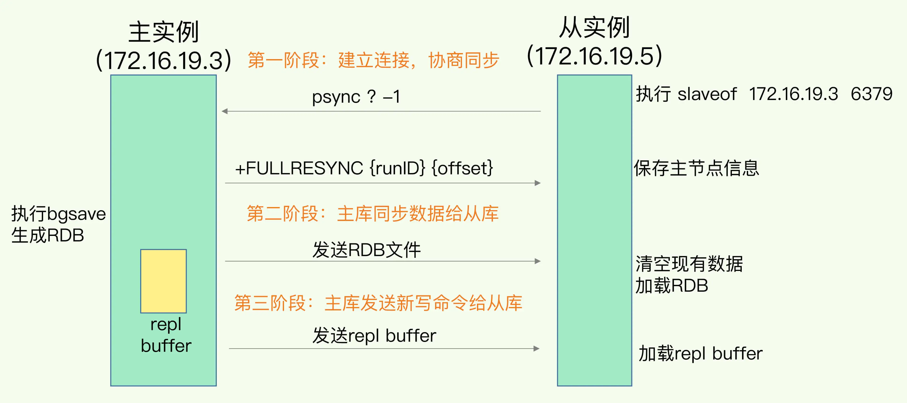
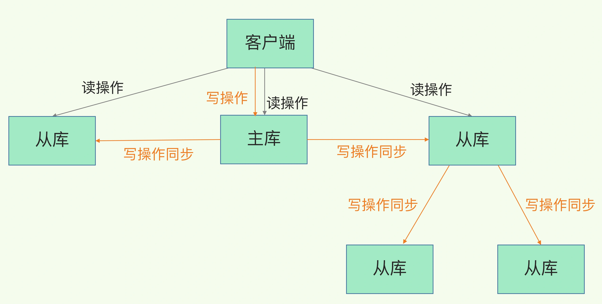

### 四、redis的高可靠性-redis中的数据持久化
#### 1.1、append only file AOF
- 写后日志
    + 先执行命令写内存
    + 记录每一条命令，以文本的形式保存到磁盘中
    + 只有当命令执行成功，才会记录到日志中
    + 三种命令执行完后写回磁盘的策略
        - always：同步写回策略，每个写命令执行完，立即同步地将日志写回磁盘
        - everySec：每秒写回，将日志写到aof文件内存缓冲区，每隔一秒把缓冲区的内容写入磁盘
        - no：操作系统控制写回，每个写命令执行完，只是先把日志写到aof文件的内存缓冲区，何时写回磁盘由操作系统确定
    + 三种写回方式-都回存在一定的宕机后数据的丢失
        - 同步写回基本可以做到不丢失数据，但是每个写命令之后都有一个写回磁盘的慢速落盘操作，不可避免的影响主线程的性能
        - 操作系统控制，落盘时机已经不在redis手中，可能会丢失大量的数据
        - 每秒写回，是同步写回和操作系统控制写回的折中，即保证性能的同时，也保证数据丢失只会在上一秒中产生的会丢失
    + aof重写机制
        - 在通过日志恢复时，会依据数据库的现状创建一个新的aof文件
        - 创建时，会将多条与同一个key相关的操作变为一个，多变一，文件就变小了
        - 重写时会阻塞主线程吗？
            + 一个拷贝，两处日志
            + 一个拷贝：每次执行重写时，主线程fork后台的bgrewriteaof子线程
                - 将主线程的内存拷贝一份给bgrewriteof子线程，包含了数据库的最新数据
                - 子线程在不影响主线程的情况下，逐一把拷贝的数据写成操作，记录入重写日志
            + 两处日志
                - 正在使用的aof日志
                - 新的aof重写日志
            
#### 1.2、redis database RDB 内存快照
- 内存快照
- 记录的是某一个时刻的数据
- 在做数据恢复时，直接把rdb文件读入内存，很快地完成恢复
    + 哪些数据做快照 拍照片取景
    + 快照时的数据还能被增删改吗 拍照片时，提示人员不用晃动
- 如何快照
    + 首先redis使用的时全量快照，将所有内存中的数据都记录到磁盘中
    + 快照指令
        - save：在主线程中执行，会导致阻塞
        - bgsave：创建子线程，专门用于写入rdb文件，避免阻塞主线程，这也是redis rdb文件生成的默认配置
    + 快照时，被快照的数据发生变化怎么处理-写时复制 copy-on-write
        - 主线程fork出子线程进行bgsave，fork的好处就是子线程可以共享主线程的内存
        - 在主线程中刚刚fork出的内存中，有某一个数据发生变化时，内存中会产生一个此数据的新副本
        - 此数据保持不变，仍然给bgsave子线程快照使用
        - 这样，即保证了快照，某一时刻数据的稳定，也不影响主线程对于数据的修改
        
    + 快照的时机是什么
        - 频繁地执行快照
            + 较大的磁盘压力，多个快照竞争有限的磁盘带宽，前一个没做完，后一个又来了，容易造成恶性循环
            + fork子线程的操作，会阻塞主线程，主线程内存越大，阻塞时间越长
        - 首次全量快照
        - 后续快照时支队修改的数据进行快照记录，避免每次全量快照的开销
        - redis4.0中提出混合使用aof日志和内存快照的方法
            + 按照一定频率执行快照
            + 两次快照之间，使用aof日志记录这期间的所有命令操作
### 五、redis的高可靠性-redis中的数据备份
- redis的读写分离操作
    + 读操作，主库和从库都可以执行
    + 写操作，只有主库可以执行，主库执行后发送给从库执行
    + 为什么会读写分离
        - 客户端对一个key进行多次修改时，如果随机发送，那么各个库之间的值是不同的
        - 若为了维护数据的相同，那么需要加锁和实例间协商修改，带来巨额的开销
- 主从库间数据的第一次同步：三个阶段
    
    + 相关指令
        - replicaof（redis5.0之前使用slaveog）
        - 在从实例中执行此命令：replicaof 172.16.19.3 6379
    + 建立连接，协商同步阶段
        - 从实例执行slaveof或者replicaof指令，发送psync指令给主库
        - psync {不知道主库的runId，所以发?} {-1代表第一次同步}  
        - 从库和主库建立连接，并告诉主库即将进行同步
        - 主库确认回复后，主从库准备开始数据同步
        - FULLRESYNC {主库的runId} {复制进度offset}
    + 主库将所有数据同步给从库
        - 从库在收到数据后，在本地完成数据加载，将原来的数据先清空，然后加载全量rdb文件
        - 此过程依赖内存快照生成的RDB文件
        - 数据同步过程中，产生的新修改数据的操作，主库会有一个内存专门保存，称为 replication buffer
        -全量复制时主库的耗时操作
            + 生成RDB文件和传输RDB文件
            + 从库较多时，主库忙于fork子进程进行数据全量同步
            + 传输RDB文件会占用很大的网络带宽
        - 主从级联模式分担复制时的主库压力
            + 将主从模式改为主从从的模式
            + 原先时一个主库进行对外执行写同步操作，此时可以选取一些从库，将其与手动选择的从库建立级联关系
            
    + 主库发送新写命令给从库，发送repl buffer
        - 此过程使用的是基于长连接的命令传播
        - 若网络断连或阻塞如何处理，是需要考虑的问题
    